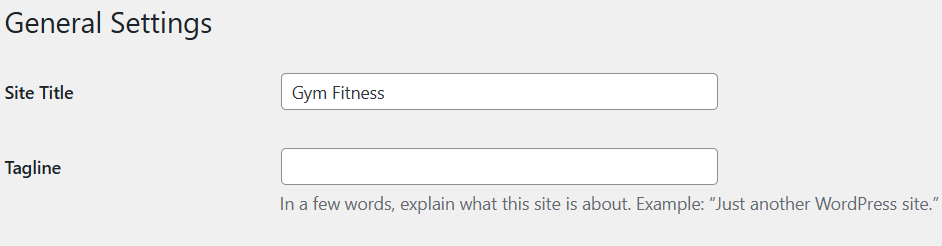

### Inserat imagine logo in Wordpress

`get_template_directory_uri()` -> returneaza folderul root al temei (folosibil si pe localhost, si ulterior pe server)

```
" alt="Site Logo" />
```

Nota:
celelalte imagini se incarca prin media library

---

### Inserat Link HOME website

Acesta poate sa fie fie `http://localohost` fie `http://yourdomain.com` . Teoretic este prima pagina a websiteului.

`echo home_url();` -> homepage url


Folosire:

```
<a href="<?php echo home_url(); ?>">
    //img
</a>
```

### Adaugat detalii despre website

#### A. Titlu website

1. inserat in pagina `<?php echo get_bloginfo('name'); ?>`   // site title

2. Schimbat din titlul websiteului din *settings / general*



#### B. Tagline
Pentru Tagline se poate folosi `'description'`, in loc de `'name'`.

Adica `<?php echo get_bloginfo('description'); ?>`


Pentru alte obtiuni, consulta documentatia aceasta la [get_bloginfo](https://developer.wordpress.org/reference/functions/get_bloginfo/).
