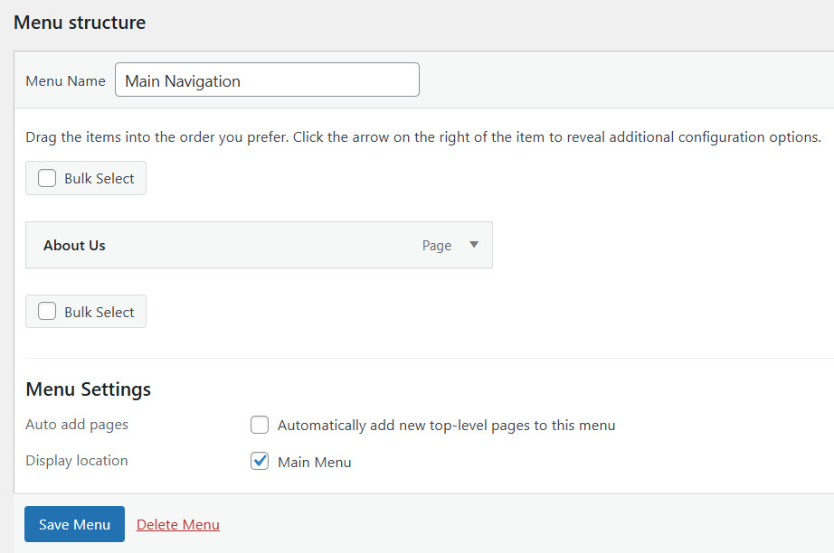

## Register the new menu in wordpress

### Register menu

Create a new file `functions.php`, care sa aiba doar tagul de deschidere `<?php`

```
function gymfitness_menus(){  // gymfitness = prefix, inaintea functiei specific temei
    register_nav_menus( array(      // register_nav_menus - capacitate de adaugat noi meniuri (de navigare)
        'main-menu' => 'Main Menu'       // main-menu - este locatia din wordpress unde va aparea
                                        // Main Menu - este descrierea ce apare la creare nou meniu la Aspect/Meniu Setari
    ));
}
add_action('init', 'gymfitness_menus'); // init - la initializare
```

### Atasat meniul la locatie

Creezi meniu nou din dashboard Appearance / Menus


Apoi alegi "Main Menu" de la locatie, fiind acelasi de mai sus




### Insert meniul

```
<?php
$args = array(
    'theme_location' => 'main-menu',    // main-menu = locatia ce vrei sa apara aici
    'container' => 'nav',               // tipul containerului | default - div
    'container_class' => 'main-menu'    // clasa pt containerului meniului
);
wp_nav_menu($args);
?>
```