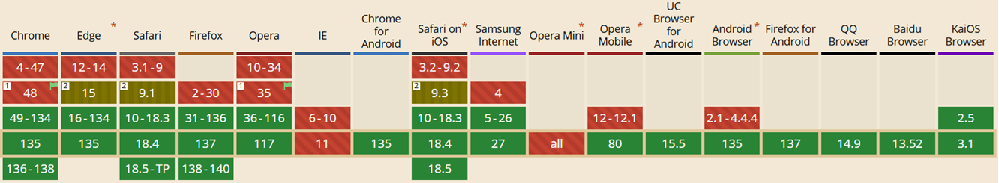

### Custom properties

Sunt niste variabile css, dar ce fac parte din css. Sunt asemanatoare cu saas, dar nu necesita configuratii suplimentare.

<a href="https://caniuse.com/css-variables">
    
</a>

1. Definire

```
:root {
    --mainFont : "Staatliches", sans-serif;
}
```

2. Utilizare

```
body {
    font-family: var(--mainFont);
}
```