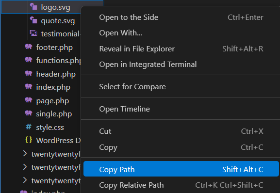

### Starting html code

`!` + TAB -> completeaza html-ul de inceput

### Copiere path imagine

pt copiere path imagine -> din panelul / explorer-ul din stanga , click dreapta pe imagine -> Copy path



### Adaugare proiect in VSCode


ctrl + P 

>save project

(denumire folder) -> `Enter`

### User snippets

ctrl + shift + p -> user snippets -> CSS

```
"media query" : {
	"prefix" : "mq",   // cum apelezi snippet-ul
	"body" : [
		"@media (min-width: $1) {\n\t$0\n}"
	]
}
```

\n - new line
\t -tab

### Identare cod

desi o stiam e bine sa o mentionez oricum

selectare mai multe randuri
`TAB` -> indentare spre dreapta
`Shift` + `TAB` -> indentare spre stanga


### Auto-completare - custom properties

daca tastezi `mainFont` sau tastezi o portiune din acesta si il selectezi -> va pune automat si var(--) si pe acesta.


### VSCode selectare path

Se tasteaza `..` sau `/` si apoi completezi bucatica cu bucatica, tot path-ul catre imagine


